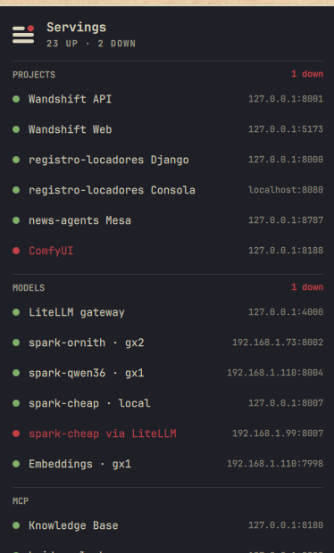

# Servings

Everything you serve on your own machines, in one Omarchy bar panel. One row
per service: a light, the name, and the address it answers on. Green when it
answers, red when it does not. Groups are yours to name: the dev servers of
your projects, the models you host, your MCP servers, the databases under
them.

The bar shows the Servings mark with the light in its corner: green while
everything is up, red the moment one thing is not, so you know before you
open anything.



## Install

```bash
omarchy plugin add https://github.com/lkzwieder/omarchy-servings.git --enable
```

Then describe what you serve in `~/.config/omarchy/servings.json`. Start from
the example that ships with the plugin:

```bash
cp ~/.config/omarchy/plugins/lkzwieder.servings/services.example.json ~/.config/omarchy/servings.json
```

The panel watches that file: save it and the rows update without waiting for
the next refresh. Right-click the bar icon to open it in your editor.

To remove the plugin:

```bash
omarchy plugin remove lkzwieder.servings
```

That deletes the checkout and the widget. Your `servings.json` stays where it
is; delete it if you want nothing left behind.

## The services file

```json
{
  "timeoutMs": 1500,
  "groups": [
    {
      "name": "Projects",
      "services": [
        { "name": "My API", "address": "127.0.0.1:8001", "path": "/health", "open": "http://127.0.0.1:8001/docs" },
        { "name": "My Web", "address": "127.0.0.1:5173", "path": "/" }
      ]
    },
    {
      "name": "Models",
      "services": [
        { "name": "llama-server · box-1", "address": "192.168.1.10:8002", "path": "/health", "detail": "Qwen3.6 35B-A3B" }
      ]
    },
    {
      "name": "MCP",
      "services": [
        { "name": "knowledge base", "address": "127.0.0.1:8180", "path": "/mcp", "expect": "any", "open": "" }
      ]
    },
    {
      "name": "Infra",
      "services": [
        { "name": "Postgres", "address": "127.0.0.1:5432", "check": "tcp" },
        { "name": "Docker", "unit": "docker.service", "scope": "system", "address": "local" }
      ]
    }
  ]
}
```

Groups appear in the order you write them, services too. Each service takes:

| Field | What it does |
|---|---|
| `name` | The label. Required. |
| `address` | `host:port`, shown on the right of the row and used by the `tcp` and `http` checks. |
| `check` | `http`, `tcp` or `systemd`. Inferred when omitted: `systemd` if there is a `unit`, `http` if there is a `path`, `url` or `expect`, `tcp` otherwise. |
| `path` | Path to GET for the `http` check, `/` by default. |
| `url` | Full URL for the `http` check, when `http://address + path` is not it. |
| `expect` | What counts as up for `http`: `"2xx"` (default), `"any"` for servers that answer 4xx to a bare GET (most MCP endpoints), another `"Nxx"` class, or a list of status codes. |
| `headers` | Extra request headers for the `http` check, as an object. |
| `unit` | systemd unit for the `systemd` check; add `"scope": "system"` for system units. |
| `detail` | A line for the tooltip: which model, which box. |
| `open` | What a click opens with `xdg-open`. Defaults to `http://address/` for `http` checks; set it to `""` for nothing. |
| `timeoutMs` | Per-service override of the file-level `timeoutMs`. |

A flat file works too: `{ "services": [ ... ] }`, each row with an optional
`"group"`.

## Panel

- **Hero**: the mark, and how many are up and down.
- **One section per group**, with a red "N down" on the right of the header
  when it has casualties.
- **Rows**: light · name · address. Hover for latency, the HTTP status or
  the error, and the detail line. Click to open the service in the browser.
- **Footer**: when the report was taken.

## Interactions

- Bar icon: left = panel, middle = refresh now, right = open the services file.
- Panel: `j`/`k` scroll, `r` or Enter refresh, Tab moves to the neighboring
  bar panel, Esc closes.
- IPC: `omarchy-shell lkzwieder.servings <open|close|toggle|refresh|status>`.
  `status` prints what the panel shows as JSON, down services listed by name,
  which makes it a one-liner for scripts and for a box you only reach over SSH.

## Settings

Settings live in the widget's entry in `~/.config/omarchy/shell.json` and can
be set with `omarchy bar set lkzwieder.servings <key> <value>`:

| Key | Default | What it does |
|---|---|---|
| `refreshIntervalSec` | `30` | How often every service is checked |
| `timeoutMs` | `1500` | Per-service timeout when the file does not say |
| `configPath` | `~/.config/omarchy/servings.json` | Where the services file is |
| `upColor` | `#7fb069` | The light when a service answers |
| `downColor` | theme urgent | The light when it does not |

Numbers need `--json`, or they land in `shell.json` as strings:

```bash
omarchy bar set lkzwieder.servings refreshIntervalSec 15 --json
omarchy bar set lkzwieder.servings upColor '#a6e3a1'
```

## How it works

`bin/servings-probe` is a Python script with no dependencies beyond the
standard library. It reads the services file, checks every row concurrently
with a hard timeout each, and prints one JSON report. `ServingsPanel.qml` runs it on
the refresh timer, whenever the panel opens, whenever the services file
changes, and on request; then it draws the report. Run the probe yourself to
see what the panel sees:

```bash
~/.config/omarchy/plugins/lkzwieder.servings/bin/servings-probe --config ~/.config/omarchy/servings.json --pretty
```
